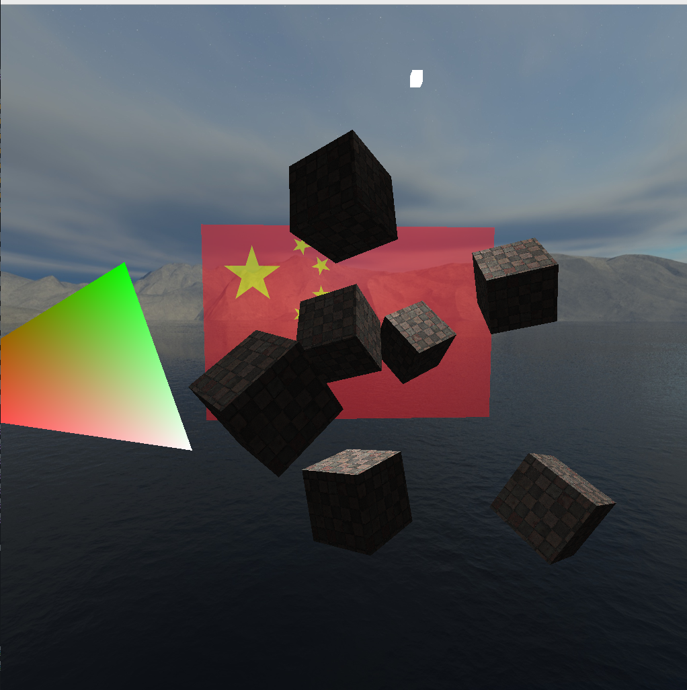

# gl_homework

## 项目简介

**作者**: 邹承甫

gl_homework库对OpenGL（基于glut和glew）进行二次封装，实现了一系列工具类和函数，能够快速开发OpenGL应用，包括以下类：

- **OpenGLApplication** ： 单例模式，对一个OpenGL应用的抽象，快速构建一个窗口

- **Shader** ： 快速加载顶点/片段着色器代码并进行编译

- **PrimitiveBuilder** ： 建造者模式，通过*buildTriangles*、*buildLines*等函数绘制基础图元

- **TextureLoader** ： 单例模式，快速加载纹理

- **Camera** ： 创建一个摄像机


通过这个库，可以按照下面方式快速构建OpenGL应用：
```cpp
int main(int argc, char** argv) {
  // 初始化
  gl_hwk::WindowOptions options;
  options.name = argv[0];
  options.width = 1024;
  options.height = 1024;

  gl_hwk::OpenGLApplication::instance().init(argc, argv, options);

  // 着色器
  auto shader = std::make_shared<gl_hwk::Shader>(
      "vert.GLSL", "frag.GLSL");

  // 纹理
  GLuint texture =
      gl_hwk::TextureLoader::instance().loadTexture("texture/wall.jpg");
  shader->start();
  shader->setInt("texture1", 0);

  // 顶点数据
  auto vertices = std::vector<glm::vec3>{
    ...
  };
 
  // 颜色或纹理坐标
  auto colors = std::vector<glm::vec3>{     
    ...  
  };


  // 摄像机
  auto camera = std::make_shared<gl_hwk::Camera>(glm::vec3(0.0f, 0.0f, -3.0f),
                                                 600.f, 1024, 1024);

  // Builder
  auto builder = std::make_shared<gl_hwk::PrimitiveBuilder>();

  // 渲染主程序
  auto render_func = [&]() -> void {
    gl_hwk::TextureLoader::instance().activeTexture(texture, GL_TEXTURE0);

    // 坐标系统
    glm::mat4 projection = camera->getProjectionMatrix();
    glm::mat4 view = camera->getViewMatrix();
    glm::mat4 model = glm::mat4(1.0f);
    shader->setMat4("projection", projection);
    shader->setMat4("view", view);
    shader->setMat4("model", model);

    builder->buildTriangles(fmt::format("cube_{}", 0), vertices, {}, colors);
  };

  // 键盘回调
  auto keyboardCallback = [](unsigned char key, int x, int y) {
    if (key == 27) {
      exit(0);
    } 
  };


  // 注册回调
  gl_hwk::OpenGLApplication::instance().onDisplay(std::move(render_func));
  gl_hwk::OpenGLApplication::instance().onKeyboardPress(
      std::move(keyboardCallback));

  // OpenGL ， 启动！
  gl_hwk::OpenGLApplication::instance().run();

  return 0;
}
```

## 依赖

- **Ubuntu22.04** ： 本项目只在Ubuntu22.04下进行过测试

- **Xmake** ： 本项目使用xmke进行构建
    ```baseh
    wget https://xmake.io/shget.text -O - | bash
    ```
- **OpenGL**

- **freeglut**

- **OpenCV**
   ```bash
   sudo apt install libopencv-dev
   ```

- **fmt**
  ```bash
  sudo apt install libfmt-dev
  ```

## 编译和运行

- 编译
    ```
    xmake
    ```

- 运行实例
    ```
    xmake run example
    ```

- 生成complie_commands.json文件用于clangd提示生成
    ```
    xmake project -k complie_commands
    ```

## 中南大学人工智能21级计算机图形学作业

- ~~作业1 完成Opengl再windows平台上的配置（选做）~~
  > 我选择Linux
  -  安装vs.net 
  -  配置OpenGl环境
  -  能够正确运行上传的工程。

- 作业2 绘制基本图元（必做）
  > 调用PrimitiveBuilder即可
  - 完成点，线，多线段，循环线，三角形，三角形条带的绘制

- 作业3 撰写GLSL（选做）
  > shader/里实现了6种
  1. 根据提供的源码编写shader，或者自己根据自己的编译环境来编辑shander
  2. 实现至少5种fragment shaders，以显示不同的效果，
  3. 绘制的几何体形状不做要求，甚至可以是一个三角形

- 作业4 实现空间转换（必做）
  > Camera类
  1. 试验图元平移、旋转，缩放（包括按固定点缩放、旋转）
  2. 实现图元的组合操作
  3. 实现图元的错切和翻转
  - 以上均在着色器中用齐次坐标实现。

- 作业5 DrawElements绘制（选做）
  > PrimitiveBuilder同时支持EBO绘制
  1. 熟悉drawelements函数，了解ebo的数据传递过程，
  2. 测试平移，旋转，缩放的效果。修改vert文件中的三个旋转矩阵
  3. 编写一般三维旋转的旋转矩阵，进行测试
  4. 使用drawelements来绘制三角形的棱

- 作业6 四面体绘制（必做）
  > example里那个绕圈圈的彩色四面体，取消注释293行的注释就是正投影  
  1. 尝试使用条带形式绘制四面体，观察绘制效果
  2. 开启/关闭背面剪裁和深度测试，观察效果的区别
  3. 使用图元重启动的方式绘制立方体
  5. 完成正投影的coding，比较正投影和透视投影的区别。

- 作业7 融合程序设计（选做
  > 取消example277行的注释
  1. 基于blend工程，或者是chapter-03-blending工程来设计融合
  2. 尽量对比多种融混glblendfunc的参数
  3. 尝试使用不同的方程式，通过设置，来完成不同的融合。
- 作业8 纹理绘制（必做）
  > 砖块和国旗
  1. 根据上传的工程进行修改
  2. 绘制一面中国国旗
  3. 使用repeat 和clamp参数来进行多面绘制
  4. 对比nearest 和 linear 过滤方式。
  5. 实现 mip图层
  6. 实现各向异性过滤方式
  7. 对比各种过滤的组合效果

- 作业9 天空盒绘制（选做）
  > 蓝天白云
  1. 根据上传的程序进行修改
  2. 完成一个3维贴图
  3. 实现skybox的渲染


- 作业10（必做）
  > 按1和2切换
  1. 根据课程内容，实现Phong光照
  2. 根据课程内容，实现Gouraud光照
  3. 绘制一个旋转的立方体，实现上述两种照明，可以通过按键'a'和‘s’来实现两种照明的切换

## example运行截图
